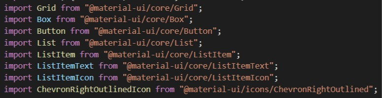
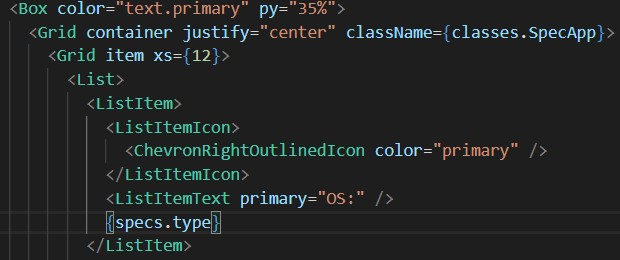
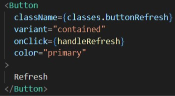

## 4. Stylisation de systemspec.js 

Passons dès à présent à la stylisation du SystemSpec !
Nous allons reprendre les différents paramètres qui sont affichés lorsque l'on appuie sur le bouton _refresh_ et les mettre sous forme de liste de Material UI ainsi que la rendre un peu jolie.

### 1. Importation des éléments de React

Commencez par importer tout ce dont vous aurez besoin pour créer et styliser la liste, il vous faudra pas mal d'éléments !
Vous aurez besoin de:

1. Grid
2. Box
3. Button
4. List
5. ListItem
6. ListItemText
7. ListItemIcon
8. ChevronRightOutlinedIcon

La partie où vous importez devrait ressembler à cela:

Maintenant que vous avez tout importé, vous possédez tout ce dont vous avez besoin pour construire et styliser la liste.

### 2. Créer la liste

Passons à la partie qui nous intéresse le plus au final. Material UI propose différentes listes tout comme il propose différents sliders comme nous l'avons vu précédemment. Vous pouvez retrouver tous les types de listes [ici](https://material-ui.com/components/lists/).

Nous avons choisi d'afficher les données sous forme de liste simple avec une icône simple également. Cette liste est appelée [Icon with text](https://material-ui.com/components/lists/#interactive)

On va insérer la list dans un `<Box>` et plusieurs `<Grid>`.

- Commencez donc par le `<Box></Box>`, à l'intérieur de ce tag insérez un premier tag `<Grid container></Grid>` et enfin à l'intérieur de ce dernier, insérez un tag `<Grid item></Grid>`
- A l'intérieur du `<Grid item>`, créez la liste avec `<List></List>`
- A l'intérieur de celui-ci, écrivez `<ListItem></ListItem>`. Dans ce dernier, écrivez `<ListItemIcon></ListItemIcon>`. Ce tag permet d'intégrer l'icône que l'on souhaite utiliser.
- A l'intérieur du `<ListItemIcon>`, appliquez l'icône en écrivant `<ChevronRightOutlinedIcon/>` en lui ajoutant la propriété **`color="primary"`**. Vous verrez l'icône s'afficher sur la page
- En dessous du `<ListItemIcon>`, insérez `<ListItemText primary="OS:">` ce qui permettra d'afficher le texte "OS:"
- En dessous de ce dernier tag, insérez `{specs.type}` afin d'afficher la valeur de la donnée que l'on souhaite afficher

Votre code devrait ressembler à cela jusqu'à présent:

- Sélectionnez à présent tout ce qui se trouve à l'intérieur de `<ListItem></ListItem>` ainsi que le tag lui-même et dupliquez le 5 fois
- Changez uniquement la valeur de **"primary"** du `<ListItemText>`. Remplacez donc **"OS"** par **"Architecture"**, **"Plateforme"**, **"Nom du PC"**, **"Mémoire totale"** et **"Mémoire restante"**
- Dans **`{specs.type}`**, remplacez **type** par **arch**, **platform**, **hostname**, **totalmem** et **freemem**. Cela sert à afficher les bonnes données selon les paramètres

### 3. Création du bouton

Maintenant que la liste est créée, passons au bouton _Refresh_.

Pour le construire, rien de plus simple:

- Intégrez `<Button>Refresh</Button>` auquel vous donnez 4 props:

1. className={}
2. variant=" "
3. onClick={}
4. color=" "

Votre code pour le bouton devrait ressembler à cela:

### 4. Stylisation de la liste

Donnons un peu plus de style à la liste !

- Dans le tag `<Box>`, donnez en propriété **`color="#DDD"`** et **`py="35%"`**, ce qui changera la couleur du texte et centrera verticalement les éléments
- Dans le tag `<Grid>` juste en dessous, ajoutez **container** et **`justify="center"`**
- Dans le tag `<Grid>` encore en dessous, ajoutez **`item xs={12}`**

Voilà, votre liste est maintenant intégrée et vous l'avez rendue un peu plus jolie visuellement ! Well done 👏

[◀ Previous step](slider.md) 🤨

# Great job ! You're all done !

